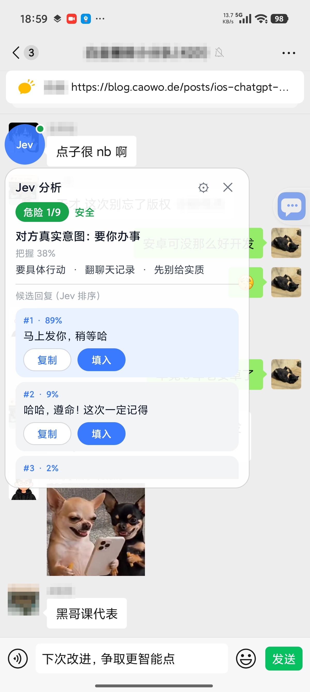

# Jev Chat Assistant

**A conversation copilot for your phone. Jev works alongside your chat apps, helps you understand what the other person means, and suggests what to say next. Tap to fill in a reply. You decide whether to send it.**

[Website](https://chatjevs.com) · [Releases](https://github.com/jev-chat/jev-chat-jarvis/releases) · [Changelog](cn/CHANGELOG.md) · [macOS](https://github.com/jev-chat/jev-chat-mac) · [Windows](https://github.com/jev-chat/jev-chat-windows)

[简体中文](README.md) · **English** · [Tiếng Việt](README.vi.md)

## Choose Your Edition

| Global edition · Android | Chinese edition · Android | Windows | macOS |
| :---: | :---: | :---: | :---: |
| Coming soon | [Download v1.7 APK](https://raw.githubusercontent.com/jev-chat/jev-chat-jarvis/main/cn/apk/jev-assistant-v1.7-release.apk) | [Get Jev for Windows](https://github.com/jev-chat/jev-chat-windows/releases) | [Get Jev for macOS](https://github.com/jev-chat/jev-chat-jarvis-mac/releases) |
| English UI · WhatsApp first | Chinese UI · QQ / Feishu / X / WhatsApp | Reply helper beside your chat window | Message intent overlay |
| Led by [@smgonthebeat](https://github.com/smgonthebeat) | Android 11+ · ARM64 · [Guide](cn/README.en.md) | Windows 10 1903+ / 11 | macOS 13+ · Apple Silicon |

Both Android editions are developed in this repository and can be installed side by side on the same phone:

- **Global edition** (`global/`, coming soon): built for English-speaking users. Message reading, the assessment question bank and the reply corpus are designed around how people chat outside China. It starts with WhatsApp, with more chat apps to follow.
- **Chinese edition** ([`cn/`](cn/)): built for Chinese-speaking users and the chat apps popular in China. It also works on WhatsApp, with a Chinese interface.

If Jev is useful to you, a **Star** on this repository helps us keep it going. You don't need to star or follow anything to download or use it.

## Sponsors

> [Interested in sponsoring the project?](#community-and-feedback)

Show or hide sponsors

<table>
<tr>
<td width="240" align="center"></td>
<td>Thanks to <b>Bocha</b> for sponsoring this project! Bocha is a search engine for AI, giving your applications access to information from across the web with clean, accurate, high-quality results. Its services include the Web Search API, Bocha Jev API, and other search and model APIs. <a href="https://open.bocha.cn">open.bocha.cn</a></td>
</tr>
<tr>
<td width="240" align="center"></td>
<td>Thanks to <b>Xiaoyou Store</b> for sponsoring this project! Xiaoyou Store sells digital products and account services, with a selection available to users of this project. <a href="https://faka.rainlanguage.top">Visit the store</a>.</td>
</tr>
<tr>
<td width="240" align="center"></td>
<td>Thanks to <b>Vytal</b> for sponsoring this project! Vytal is an AI video workflow platform with reusable workflows for batch production, making video creation more accessible to content creators, training providers, and small teams. <a href="https://agent.ai-tools.cn">Visit Vytal</a>.</td>
</tr>
</table>

## Screenshots (Chinese edition)

<table align="center">
<tr>
<td align="center"> Overlay: risk level, the other person's intent, and three ranked replies</td>
<td align="center"> Settings: separate API configurations for assessment, replies, and vision</td>
</tr>
</table>

## Why Jev?

- **It assesses the conversation before drafting a reply.** Most tools simply ask a model to write a response. Jev first uses an assessment model to identify the other person's intent, gauge the risk, and decide whether a reply can wait. That assessment guides its suggestions.
- **It leaves your chat apps alone.** No hooking, modified app packages, access to app APIs or accounts, or database reads. Jev uses Android's accessibility service to read the conversation currently visible on your screen.
- **You're always in control of sending.** Jev only fills in the text field. It never sends messages automatically or interacts with transfers, red packets, or payment collection.

> **Use at your own risk:** Using Jev inside third-party apps such as QQ, Feishu, X, or WhatsApp may not comply with those apps' terms of service, and your account could be restricted or banned. Decide for yourself whether to use it.

## Community and Feedback

**Please get in touch by messaging the WeChat official account.** Use it for partnerships, sponsorships, feedback, trouble joining a group, or expired QR codes. Messages sent elsewhere may be missed.

We'd love to hear what you actually need. Which chat app would you most like to use Jev with? What should it pick up on, how should it alert you, and what should it never touch? Send your thoughts to the official account.

Show community group QR codes. These groups are full or their QR codes have expired; message the official account for a current code.

<table align="center"><tr>
  <td align="center"> Group 1</td>
  <td align="center"> Group 2</td>
  <td align="center"> Group 3</td>
  <td align="center"> Group 4</td>
  <td align="center"> Group 5</td>
  <td align="center"> Group 6</td>
  <td align="center"> Group 7</td>
  <td align="center"> Group 8</td>
  <td align="center"> Group 9</td>
</tr></table>

## Related Projects

Also part of the [jev-chat](https://github.com/jev-chat) organization:

- [Jev Chat Assistant for macOS](https://github.com/jev-chat/jev-chat-jarvis-mac): A read-only overlay that reads the screen, uses a small local model to assess intent and risk, and generates suggested replies based on conversation guidance.
- [Jev Chat Assistant for Windows](https://github.com/jev-chat/jev-chat-windows): A reply assistant that sits beside your chat window. Uses window screenshots and local offline OCR, with three suggested replies you can insert with a click. Sending is always manual.

See [PRIVACY.md](cn/PRIVACY.md) for details on what is read, where it is sent and stored, and how to delete it.

## Friend Links

<table>
<tr>
<td width="150" align="center"> <b>Lanyi Jianke</b></td>
<td>Senior AI expert and author; Volcengine Navigator KOL, Alibaba Cloud Agent Maker, and core WaytoAGI creator. Deeply experienced in software development, system architecture, and project management. Author of bestselling AI books including <i>Efficient Office Work with Doubao</i> and <i>Efficient Office Work with Kimi</i>; winner of JD Books' 2025 Super New Book award and 2025 CMPress Creation Star. He has contributed to AI standards and national-level reports, and has provided enterprise AI consulting and implementation for dozens of Fortune Global 100 companies.  GitHub: <a href="https://github.com/lanyijianke">@lanyijianke</a> · Email: <a href="mailto:lanyijianke@outlook.com">lanyijianke@outlook.com</a></td>
</tr>
</table>

## Copyright and License

Copyright © 2026 Finderchangchang and the jev-chat contributors. The code is available under the [MIT License](LICENSE). See also [NOTICE](NOTICE). Contributors are listed in [CONTRIBUTORS](.github/CONTRIBUTORS.md).

- **Commercial use is allowed:** Individuals and companies may use, modify, redistribute, or integrate the code into their own products without payment or prior permission.
- **Attribution is required:** Keep LICENSE and NOTICE when distributing or using the project commercially, and credit the source in your product's About page, documentation, or release page. Suggested wording: `Based on Jev Chat Assistant (https://github.com/jev-chat/jev-chat-jarvis)`.
- Do not use the names "Jev Chat Assistant" ("Jev 聊天助手") or "jev-chat", or the domain chatjevs.com, to imply that your product was made or endorsed by the original authors.

**Disclaimer:** This project only processes conversations on your own device that you are authorized to view. Follow the terms of service of QQ, X, Feishu, WhatsApp, and any other apps you use, as well as applicable local laws and regulations. The authors accept no responsibility for the consequences of its use.
